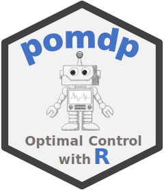

#  R package pomdpSolve - Interface to ‘pomdp-solve’ for Partially Observable Markov Decision Processes

[](https://CRAN.R-project.org/package=pomdpSolve)
[](https://mhahsler.r-universe.dev/pomdpSolve)
[](https://CRAN.R-project.org/package=pomdpSolve)

Provides [pomdp-solve](http://www.pomdp.org/code/) (Cassandra, 2015) to
solve POMDPs using a variety of algorithms. A convenient interface is
provided in package [pomdp](https://github.com/mhahsler/pomdp).

## Installation

**Stable CRAN version:** Install from within R with

``` r
install.packages("pomdpSolve")
```

**Current development version:** Install from
[r-universe.](https://mhahsler.r-universe.dev/pomdpSolve)

``` r
install.packages("pomdpSolve", repos = "https://mhahsler.r-universe.dev")
```

## Usage

Solve a POMDP file that ships with this package in a temporary directory
and read the solution.

``` r
library(pomdpSolve)

old_wd <- setwd(tempdir())
file.copy(system.file("tiger.aaai.POMDP", package = "pomdpSolve"), "./tiger.aaai.POMDP")
```

    ## [1] TRUE

``` r
pomdp_solve("tiger.aaai.POMDP", options = list(method = "grid"), verbose = FALSE)
dir()
```

    ## [1] "tiger.aaai-0.alpha" "tiger.aaai-0.pg"    "tiger.aaai.POMDP"

``` r
read_alpha_file("tiger.aaai-0.alpha")
```

    ##         V1    V2
    ## [1,] -98.5  11.5
    ## [2,] -10.9   6.5
    ## [3,]   1.9   1.9
    ## [4,]   6.5 -10.9
    ## [5,]  11.5 -98.5

``` r
read_pg_file("tiger.aaai-0.pg")
```

    ##   N A Z1 Z2
    ## 1 1 2  3  3
    ## 2 2 1  3  1
    ## 3 3 1  4  2
    ## 4 4 1  5  3
    ## 5 5 3  3  3

``` r
setwd(old_wd)
```

The value function is defined by a set of alpha vectors represented as
rows in a matrix with $V$ components. Each alpha vector corresponds to a
node with the same row number in the policy graph. The policy graph
represents the policy in the form of a data.frame with one row for each
node. Nodes have a node id $N$, the action $A$ defined by the policy and
then for each observation $Z_i$ the id (row) of the policy graph node to
transition to.

A detailed description of the available solver options can be found
[here](https://mhahsler.github.io/pomdpSolve/pomdp-solve_manual).

## How to Cite this Package

To cite package ‘pomdpSolve’ in publications use:

Hahsler M, Cassandra AR (2023). *pomdpSolve: Interface to ‘pomdp-solve’
for Partially Observable Markov Decision Processes*. R package version
1.0.3, <https://github.com/mhahsler/pomdpSolve>.

A BibTeX entry for LaTeX users is

@Manual{, title = {pomdpSolve: Interface to ‘pomdp-solve’ for Partially
Observable Markov Decision Processes}, author = {Michael Hahsler and
Anthony R. Cassandra}, year = {2023}, note = {R package version 1.0.3},
url = {<https://github.com/mhahsler/pomdpSolve>}, }

## References

- Cassandra, A. (2015). pomdp-solve: POMDP Solver Software,
  <http://www.pomdp.org>.
